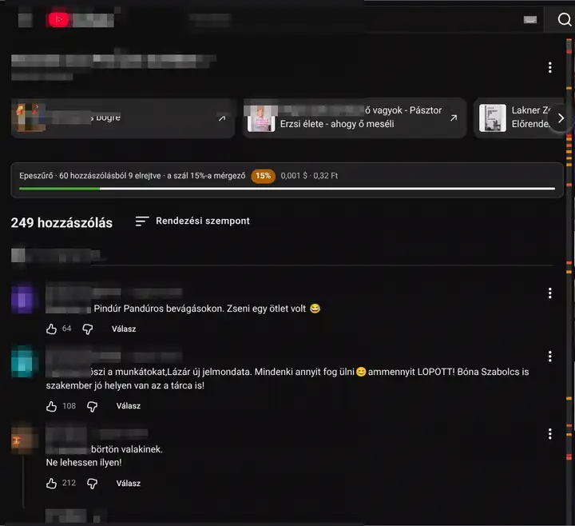

# Epeszűrő

**Magyar** · [English](README.en.md)

Chrome-bővítmény, amely a TypeSafe **Jev** modelljével átnézi a YouTube-hozzászólásokat és az élő chat üzeneteit. A súlyos gyűlölködést iratmegsemmisítő animációval eltünteti, a trágár vagy sértő szöveget elhomályosítja, a gúnyt pedig megjelöli. Az eredeti hozzászólás kattintással bármikor megnézhető.

A hozzászólások fölött látható gyűlöletindex megmutatja, hány hozzászólásból hányat rejtett el a bővítmény. A mérgező arány külön zöld, narancssárga vagy piros százalékos jelvényen jelenik meg, mellette az oldalon elköltött összeg dollárban és forintban látszik. Minden a böngészőben fut; a Jev-hívások közvetlenül a TypeSafe API-hoz mennek a saját kulcsoddal.




*A felvételen a felhasználóneveket és az avatarokat kitakartuk.*

## Telepítés

1. Töltsd le a legfrissebb kiadást a [Releases](https://github.com/naturalmoods/epeszuro/releases/latest) oldalról (`epeszuro-<verzió>.zip`), és csomagold ki. Vagy: `git clone https://github.com/naturalmoods/epeszuro.git`.
2. Chrome → `chrome://extensions` → jobb felül kapcsold be a **Fejlesztői módot**.
3. Kattints a **Kicsomagolt bővítmény betöltése** gombra, és válaszd ki az Epeszűrő mappáját.
4. A bővítmény kártyáján nyisd meg a **Részletek → Bővítménybeállítások** oldalt, vagy a felugró ablakban kattints az **API-kulcs beállítása** hivatkozásra.
5. Írd be a https://typesafe.ai oldalon kapott TypeSafe API-kulcsot, majd kattints a **Mentés** gombra.
6. Nyiss meg vagy tölts újra egy YouTube-videót.

Az API-kulcs a böngésző `chrome.storage.local` tárolójában marad. Ne írd forrásfájlba, tesztbe vagy verziókezelésbe.

## Mit csinál az oldalon?

- **Megsemmisítés:** az erőszakra buzdító, dehumanizáló vagy védett csoportot támadó hozzászólás szétesik, majd egy rövid sáv marad a helyén.
- **Homályosítás:** a trágár, obszcén vagy erősen személyeskedő hozzászólás elmosódik.
- **Jelölés:** a gúnyos hozzászólás narancssárga jelölést és rövid indokot kap.
- **Felfedés:** a megsemmisített hozzászólásnál a „megnézem” hivatkozás, a homályosítottnál maga a hozzászólás mutatja meg az eredeti szöveget.
- **Gyűlöletindex:** a kommentszál tetején folyamatosan mutatja az átnézett és elrejtett hozzászólások számát, a mérgező arányt színes százalékos jelvényen, valamint az adott videón elköltött összeget dollárban és forintban. Videóváltáskor a költség nullázódik.
- **Hőtérkép:** a kommentszál jobb szélén piros, vörösesnarancs és narancssárga vonások jelzik a megsemmisített, homályosított és megjelölt hozzászólások helyét. Rámutatva látszik az indok, kattintva odagörget az oldal; az áttetsző keret az éppen látható részt mutatja. Keskeny ablakban nem jelenik meg.
- **Élő chat:** az üzeneteknél animáció nélkül, egy sorba húzza össze a súlyosakat; a chat üzenetei fölött az átnézett és elrejtett üzenetek száma, a mérgező arány jelvénye és az adott chatkeret költsége látszik. Világos és sötét témában is olvasható, iframe-ben és külön ablakban is működik.

A beállításokban az **USD/HUF árfolyam** adható meg, alapértéke 320; a nyitott oldalak költségkijelzése azonnal követi a változását. A bővítmény ikonjára kattintva ki- és bekapcsolható a szűrés. Három csúszka állítja a megsemmisítés, a homályosítás és a gúnyjelölés érzékenységét. A gúnyjelölés és az alapból bekapcsolt **Hőtérkép** külön is kikapcsolható. A csúszkák csak a kódban meghozott döntési küszöböket változtatják; emiatt nem kell újra elküldeni a hozzászólást.

## Működés

A bővítmény minden hozzászólásról hat szűk kérdést tesz fel a Jevnek egyetlen kérésben:

1. buzdít-e fizikai erőszakra, fenyeget-e vele, vagy helyesli-e;
2. féregként, állatként, élősködőként vagy mocsokként dehumanizál-e valakit;
3. támad-e védett tulajdonság alapján egy embercsoportot;
4. trágár vagy obszcén-e, beleértve az elrejtett káromkodást és a szexuális célzást;
5. gúnynévvel vagy megvető címkével hivatkozik-e valakire;
6. mennyire erős a személyes támadás: nincs támadás, gúny, sértés vagy megalázó gyalázkodás.

A Jev valószínűségeket és egy személyeskedési pontszámot ad vissza. Nem a modell választ a három megjelenési mód közül: a `src/judge.js` küszöbei alapján a kód dönt a megsemmisítésről, homályosításról vagy jelölésről. A válaszoknál a szülő hozzászólás legfeljebb 300 karaktere is kontextusként szolgál. Élő chatnél legfeljebb öt korábbi üzenetből, egyenként legfeljebb 200 karaktert kap a modell; csak a vizsgált üzenetről dönt.

Az API-hoz csak a videó címe, a csatorna neve, a hozzászólás vagy chatüzenet szövege, válasznál a szülő szövege, chatnél a korábbi üzenetek szövege megy. Szerzőnevet a bővítmény nem küld. Az eredmény a szöveg, a kontextus, a modell és a kérdésverzió alapján 48 óráig gyorsítótárban marad; azonos szöveg azonos kontextussal ezalatt nem kér új pontozást. A lejárt bejegyzéseket a háttérfolyamat indulásakor törli.

## Mért költség és sebesség

A mérések két kézzel címkézett tesztmintán készültek (`test/fixtures/yt-1.json`, `test/fixtures/yt-2.json`). Mindkettő **kitalált szöveg**, egy-egy valódi YouTube-szál mintájára: ugyanazok a kategóriák, csapdák és címkék, de minden név, párt és gúnynév kitalált. Az első egy politikai kommentszál, a második egy barátságos, főleg gasztro témájú élő chat. A mentett válaszok a `test/out/` mappában vannak. Az ár 0,042 USD / millió bemeneti token, az átváltás 320 Ft/USD.

| Minta | Feldolgozott komment | Idő | Bemeneti token | Költség |
| --- | ---: | ---: | ---: | ---: |
| `yt-1` | 33 | 604 ms | 19 201 | 0,000806 USD ≈ 0,26 Ft |
| `yt-2` | 70 | 1328 ms | 39 812 | 0,00167 USD ≈ 0,54 Ft |

Az első minta 29 hozzászólásából 4-nek pártnév-cserés változata is van, ezért 33 a feldolgozott darabszám. Az idő a hálózattól és a szolgáltatás terhelésétől függ.

## Mért pontosság

A jelenlegi küszöbökkel, egy élő futás mentett Jev-válaszain, a kézi címkékhez viszonyítva:

| Minta | Pontos egyezés | Indokolatlan elrejtés | Kihagyott súlyos |
| --- | ---: | ---: | ---: |
| `yt-1` | 26/29 | 0 | 1 |
| `yt-2` | 67/70 | 0 | 0 |

- `yt-1`: a lincselésre buzdító komment megsemmisítést kapott (erőszak 0,96). A kihagyott súlyos a szexuális célzás csúnya szó nélkül („vegye a szájára azt, amire gondolok”), két enyhébb gúny jelölés nélkül maradt. A „szarkeverő” kommentnél a megsemmisítést is elfogadjuk, mert a „mocsoknak nevezés” a dehumanizálás-kérdés meghatározása szerint az is; ezt a második címkét a mérés után adtuk hozzá.
- `yt-2`: a „fenyegetés” szót tartalmazó ártalmatlan kérdések, a szalagfűrész és a kick box mind tiszta maradt. A „kopasz vagy?” kérdés és a „Kopasz” megszólítás tévesen jelölést kapott, a „cirkuszigazgató… szektája” jelölés nélkül maradt.

Az élő chat `yt-2` mintáján az előző öt üzenetet hozzáadó, külön mentett mérés (`test/out/yt-2.v2.ctx.json`):

| Kontextus | Pontos egyezés | Indokolatlan elrejtés | Kihagyott súlyos | Bemeneti token | Idő |
| --- | ---: | ---: | ---: | ---: | ---: |
| Nélkül | 67/70 | 0 | 0 | 39 812 | 1328 ms |
| Öt korábbi üzenettel | 67/70 | 0 | 0 | 49 331 | 702 ms |

A kontextus ezen a mintán nem javított, és 24%-kal több tokent visz. A bővítmény élő chatben mégis küldi, mert rövid, előzmény nélkül félreérthető üzeneteknél segíthet; ezt nagyobb mintán érdemes újramérni.

A `yt-1` pártsemlegességi próbájában a négy névcsere egyetlen döntést sem változtatott meg, a nyers értékek legnagyobb eltérése 0,24.

## Tesztek

Minden Node-parancsnál érdemes eltávolítani a környezetből a valódi kulcsot, hogy a mentett válaszokkal fusson:

```bash
env -u TYPESAFE_API_KEY node test/jev.mjs
env -u TYPESAFE_API_KEY node test/jev.mjs test/fixtures/yt-2.json
env -u TYPESAFE_API_KEY node test/page.mjs
env -u TYPESAFE_API_KEY node test/youtube.mjs
env -u TYPESAFE_API_KEY node test/livechat.mjs
```

- `test/jev.mjs`: a `yt-1` kézzel címkézett mintát értékeli, kiírja a pontosságot, a pártsemlegességi próbát, az időt, a tokenszámot és a költséget.
- `test/jev.mjs test/fixtures/yt-2.json`: ugyanez a második, barátságos élőchat-mintán.
- `test/page.mjs`: helyi HTML-fixtúrákon ellenőrzi a hozzászólásokat és az élő chatet: sorrendhelyes kontextus, szerzőnevek kihagyása, csak emojiból álló üzenetek, újrahasznosított elemek, effektek, számláló és hőtérkép.
- `test/youtube.mjs`: valódi YouTube-oldalon kibont legalább egy válaszszálat, ellenőrzi a mai DOM-ot és a szülőszöveg továbbadását, kiírja a hőtérkép vonásainak számát és `test/out/youtube-heatmap.png` képet ment. Szimulált pontszámokat használ, ezért nem hívja a TypeSafe API-t.
- `test/livechat.mjs`: valódi élő chatben ellenőrzi az üzeneteket, a kontextust, a számlálót és a szöveg olvashatóságát világos és sötét témában; szimulált pontszámokkal fut, és `test/out/livechat-light.png`, `test/out/livechat-dark.png` képeket ment. A `--context` jelzővel végzett `test/jev.mjs test/fixtures/yt-2.json --context` élő API-mérés a külön `.ctx.json` fájlt írja.

Ha a `TYPESAFE_API_KEY` be van állítva, a `test/jev.mjs` élő TypeSafe API-hívásokat végez, és felülírja a mentett válaszfájlt. Kulcs nélkül a `test/out/` meglévő válaszait értékeli újra. A böngészős tesztekhez telepített `chromium` szükséges.

## Fájlok

- `src/content.js`, `src/content.css` – hozzászólások felismerése, válaszkapcsolat, effektek, gyűlöletindex és hőtérkép
- `src/chat.js`, `src/chat.css` – élő chat az iframe-ben és a külön ablakban
- `src/background.js` – kötegelés, párhuzamos Jev-hívások és 48 órás gyorsítótár
- `src/judge.js` – a hat Jev-kérdés és a döntési szabályok
- `popup.html`, `popup.js` – kapcsolók, érzékenységi csúszkák és számlálók
- `options.html`, `options.js` – API-kulcs, modell és USD/HUF árfolyam beállítása

## Korlátok

- A névbe rejtett trágárságot, például a káromkodássá alakított névpoénokat a Jev gyakran nem ismeri fel.
- A gúnyos becenevek értelmezéséhez sokszor több beszélgetési kontextus kellene, mint amennyi egy hozzászólásból és a szülőszövegből látszik.
- Az élő chat gyorsan cseréli az üzeneteit: a számláló a bővítmény elindulása óta látott üzeneteket méri, a túl gyorsan eltűnő üzenetek kimaradhatnak. Az emojiból álló üzeneteket kihagyja.
- A működés a YouTube DOM-jától függ. Ha az oldal szerkezete megváltozik, a hozzászólás- vagy válaszválasztókat frissíteni kell.
- A Jev valószínűségi modell, ezért ugyanarra a mintára két élő futás nem feltétlenül ad teljesen azonos értékeket vagy döntéseket.
- A TypeSafe nem ír magyar nyelvű támogatásról (a kérdések ezért angolok); magyar szövegen a pontosságot saját mintán kell ellenőrizni. A fenti számok két szálból, 99 hozzászólásból származnak.

## Adatvédelem

A bővítmény harmadik felek által írt YouTube-hozzászólások és élő chatüzenetek szövegét elküldi a TypeSafe szolgáltatásának feldolgozásra. Ezzel együtt a videó címe, a csatorna neve, válaszoknál a szülő hozzászólás részlete, chatnél legfeljebb öt korábbi üzenet szövege is kimegy. Szerzőnevet nem küld. A használat előtt vedd figyelembe a TypeSafe adatkezelési feltételeit és azt, hogy a hozzászólók nem közvetlenül az Epeszűrőnek adták meg a szövegüket.

## Licenc

MIT-licenc ([eredeti angol szöveg](LICENSE), [magyar fordítás](LICENSE.hu.md)) – szabadon használható, módosítható és terjeszthető, akár üzleti célra is. Az egyetlen feltétel, hogy a szerzői jogi megjegyzés (© Cziczlavicz Péter) maradjon meg a kódban vagy a leírásban. Ha felhasználod, örülünk, ha szólsz, vagy megemlíted az Epeszűrőt a projektedben.

**Szerző:** Cziczlavicz Péter
